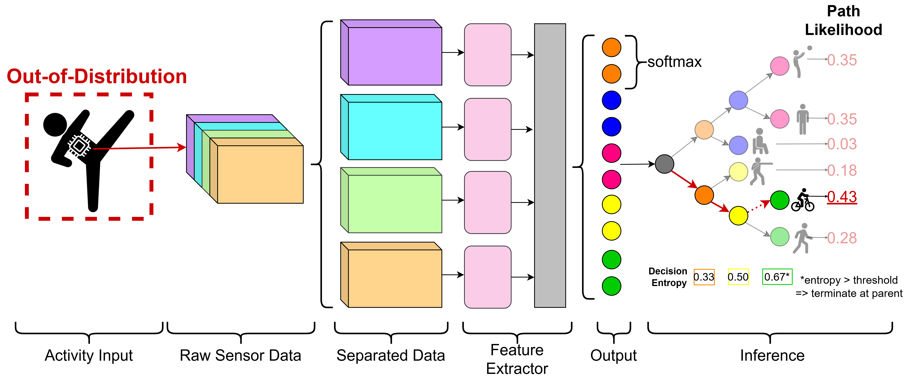

# Hi-OSCAR

This is the official implementation of Hi-OSCAR: Hierarchical Open-ser Classifier for Human Activity Recognition.



## Installation

Install the required packages 

```bash
pip install -r requirements.txt
```

Download the datasets you wish to use. Currently the repo supports the following datasets:
- [NFI_HAR](https://huggingface.co/datasets/NetherlandsForensicInstitute/NFI_FARED)
- [OPPORTUNITY](https://archive.ics.uci.edu/dataset/226/opportunity+activity+recognition)
- [PAMAP2](https://archive.ics.uci.edu/dataset/231/pamap2+physical+activity+monitoring)

Download the datasets from the links above and add the paths to the datasets on your machine to `conf/main.yaml`, then run: 
``` 
python data/parsing/make_<DATASET_NAME>.py
```
to parse the dataset into 10 and 5 second windows and store them in `data/clean`.

The OPPORTUNITY dataset can be parsed/run for both the higher-order activities (oppo) and the locomotive ones (oppo_lctm).

## Usage

The NFI_HAR dataset can be run, using activity `running` as the out-of-distribution (OOD) class with:
``` 
python main.py data=NFI_HAR tree.excluded_classes=running
```
Running `tree.excluded_classes=none` uses all classes for training/testing.
OPPORTUNITY uses the NULL class for OOD, and PAMAP does not allow for OOD analysis.

Behaviour defaults to k-fold cross-validation over the subjects. This can be changed by specifying `evaluation.set_folds=<LIST_OF_SUBJECTS>`, e.g.:
``` 
python main.py data=NFI_HAR tree.excluded_classes=sitting evaluation.set_folds=[[1,2], [3,4]]
```
which runs two folds, using subjects (1,2) and (3,4) as the test sets, respectively.

wandb is used to store and log results. You can specify your information in `conf/wandb/wandb.yaml`

## Citation

If you wish to use this work in your research, please cite:
```
@article{mccarthy2025hi,
  title={Hi-OSCAR: Hierarchical Open-set Classifier for Human Activity Recognition},
  author={McCarthy, Conor and Quirijnen, Loes and van Zandwijk, Jan Peter and Geradts, Zeno and Worring, Marcel},
  journal={arXiv preprint arXiv:2510.08635},
  year={2025}
}
```